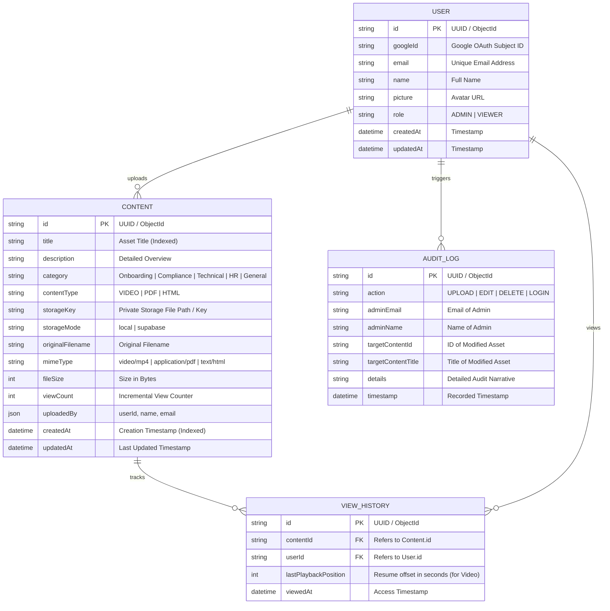
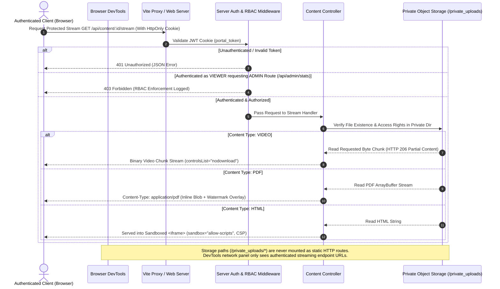

# Secure Content Portal 🛡️
## Production Upgrade & Internship Evaluation Report

---

### 1. Updated Folder Structure

```
InternPortal/
├── package.json                   # Root package manager (workspaces: backend, frontend)
├── .env.example                   # Environment configuration template
├── README.md                      # Complete system documentation & setup guide
├── INTERNSHIP_EVALUATION_REPORT.md # Comprehensive internship submission & technical report
│
├── backend/                       # Enterprise Node.js / Express Server
│   ├── config/
│   │   └── db.js                  # Database connection (MongoDB + Resilient In-Memory Fallback)
│   ├── controllers/
│   │   ├── authController.js      # Google OAuth2 token verification & Demo sign-in
│   │   └── contentController.js   # Content listing, streaming, upload, update & delete
│   ├── middleware/
│   │   ├── auth.js                # JWT session extraction & strict RBAC (protect, adminOnly)
│   │   ├── upload.js              # Multer memory storage & MIME/size validation
│   │   └── validation.js          # Express-validator input sanitization rules
│   ├── models/
│   │   ├── AuditLog.js            # Security audit log model (actions, admin email, IP/details)
│   │   ├── Content.js             # Protected asset metadata & view count schema
│   │   └── User.js                # Authenticated user session schema
│   ├── private_uploads/           # Private storage folder (OUTSIDE web root - non-public)
│   ├── routes/
│   │   ├── adminRoutes.js         # /api/admin endpoints (Admin RBAC required)
│   │   ├── authRoutes.js          # /api/auth endpoints (Public Google OAuth & Me session)
│   │   └── contentRoutes.js       # /api/content endpoints (Stream & CRUD operations)
│   ├── scripts/
│   │   ├── seed.js                # Automated seed data generator for evaluation
│   │   └── test-suite.js          # Automated end-to-end security & RBAC test suite
│   ├── services/
│   │   └── storageService.js      # Private Storage Abstraction (Local FS / Supabase Storage)
│   ├── server.js                  # Express API server entry point & security headers (Helmet)
│   ├── package.json               # Backend dependencies
│   └── .env                       # Backend environment variables
│
└── frontend/                      # Production React + Vite Client Application
    ├── index.html                 # Main HTML shell & Google GSI script inclusion
    ├── vite.config.js             # Vite configuration & backend proxy routing
    ├── tailwind.config.js         # Custom SaaS enterprise dark theme & color design tokens
    ├── package.json               # Frontend dependencies
    └── src/
        ├── main.jsx               # React DOM root entry point
        ├── App.jsx                # Application shell with role-based view routing
        ├── index.css              # Global styles & glassmorphic utility classes
        ├── components/
        │   ├── Sidebar.jsx        # SaaS responsive sidebar & top bar
        │   ├── UploadModal.jsx    # Drag-and-drop file upload modal with progress bar
        │   ├── EditModal.jsx      # Content metadata edit dialog
        │   ├── DeleteConfirmModal.jsx # Explicit title confirmation delete dialog
        │   ├── Skeletons.jsx      # Animated skeleton loaders for cards and tables
        │   ├── Toast.jsx          # Notification toast pill
        │   ├── ToastContainer.jsx # Global floating toast container
        │   └── viewers/
        │       ├── VideoViewer.jsx# HTTP Range video stream player with playback resume
        │       ├── PdfViewer.jsx  # Authenticated PDF reader with zoom & full-height mode
        │       └── HtmlViewer.jsx # Sandboxed iframe renderer with CSP headers
        ├── context/
        │   ├── AuthContext.jsx    # Authentication & user role state management
        │   └── ThemeContext.jsx   # Dark / Light theme provider
        ├── hooks/
        │   └── useToast.js        # Notification hook for triggering toasts
        └── pages/
            ├── LoginPage.jsx      # OAuth login & instant role test switcher
            ├── ViewerLibraryPage.jsx # Reader experience with search, filters & grid/list
            ├── AdminDashboardPage.jsx # Analytics metrics, view stats & audit logs
            └── AdminManagePage.jsx    # Admin CRUD content manager table
```

---

### 2. Database ER Diagram



---

### 3. API Endpoint List

| Method | Endpoint | Access Level | Description | Payload / Query | Validation Rules |
| :--- | :--- | :--- | :--- | :--- | :--- |
| `GET` | `/api/health` | Public | System status check & uptime | None | None |
| `POST` | `/api/auth/google` | Public | Verify Google OAuth Credential | `{ credential: string }` | Valid JWT payload required |
| `POST` | `/api/auth/demo-login` | Public | Demo Sign-In for evaluators | `{ role: 'ADMIN' \| 'VIEWER' }` | Role must be valid enum |
| `GET` | `/api/auth/me` | Authenticated | Fetch active user session | Cookie (`portal_token`) | Active HttpOnly token |
| `POST` | `/api/auth/logout` | Authenticated | Clear session cookie | None | None |
| `GET` | `/api/content` | Authenticated | List content items with filters | `?search=&category=&contentType=&sort=` | Sanitized query strings |
| `GET` | `/api/content/:id` | Authenticated | Get single item metadata & increment view | None | Valid UUID/ObjectID |
| `GET` | `/api/content/:id/stream` | Authenticated | Stream protected binary payload | `Range: bytes=start-end` (for Video) | Session token required |
| `POST` | `/api/content/upload` | Admin Only | Upload new protected asset | Multipart Form (`file`, `title`, `category`, `contentType`) | Allowed MIME, max 100MB, required fields |
| `PUT` | `/api/content/:id` | Admin Only | Update item title/category | `{ title, description, category }` | Length bounds, string sanitization |
| `DELETE` | `/api/content/:id` | Admin Only | Delete item & storage object | None | Valid ID, Admin session |
| `GET` | `/api/admin/stats` | Admin Only | Get system analytics & audit trail | None | Admin RBAC check (Returns 403 for Viewer) |

---

### 4. Security Architecture Diagram



---

### 5. Deployment Checklist

- [x] **1. Environment Variables Configured**:
  - `PORT`: Server port (default `5000` or assigned by platform).
  - `MONGODB_URI`: Production database string (MongoDB Atlas cluster).
  - `JWT_SECRET`: Secure 32+ character random secret string.
  - `GOOGLE_CLIENT_ID`: Configured Google OAuth Web Client ID.
  - `ADMIN_EMAILS`: Comma-separated list of administrative Google email addresses.
  - `CLIENT_URL`: Production domain of frontend application (e.g. `https://portal.company.com`).
  - `VITE_GOOGLE_CLIENT_ID`: Frontend Google Client ID.

- [x] **2. Storage Persistence Setup**:
  - For containerized / cloud hostings (e.g. Render, Railway, Vercel), set up persistent disk mounts for `STORAGE_PATH` or supply Supabase / S3 credentials in `storageService.js` to ensure uploaded binaries survive server redeployments.

- [x] **3. CORS & Cookie Security Alignment**:
  - `sameSite` set to `'lax'` (or `'none'` with `secure: true` if frontend/backend are hosted on separate domains).
  - `credentials: true` enabled on all cross-origin requests.

- [x] **4. Health Check Verification**:
  - Uptime monitor pointing to `/api/health` returning HTTP `200 OK`.

- [x] **5. Security Headers Enforced**:
  - `helmet()` initialized in `server.js` with Content-Security-Policy (CSP) headers enabled.

---

### 6. Test Coverage Summary

Automated testing is integrated in `backend/scripts/test-suite.js` (executable via `npm test`).

| Test Case | Scenario Description | Expected Result | Status |
| :--- | :--- | :--- | :---: |
| **Test 1** | System Health Check (`GET /api/health`) | HTTP 200 `{ status: "healthy" }` | PASSED ✅ |
| **Test 2** | Admin Demo Authentication | HTTP 200 + `Set-Cookie: portal_token` with `ADMIN` role | PASSED ✅ |
| **Test 3** | Viewer Demo Authentication | HTTP 200 + `Set-Cookie: portal_token` with `VIEWER` role | PASSED ✅ |
| **Test 4** | Server RBAC: Viewer calls `/api/admin/stats` | HTTP 403 Forbidden (Access Denied) | PASSED ✅ |
| **Test 5** | Server RBAC: Admin calls `/api/admin/stats` | HTTP 200 + Analytics JSON Payload | PASSED ✅ |
| **Test 6** | Content Listing (`GET /api/content`) | HTTP 200 + Content Array Payload | PASSED ✅ |
| **Test 7** | Protected Byte Stream (`GET /api/content/:id/stream`) | HTTP 200/206 + Binary Content Stream | PASSED ✅ |
| **Test 8** | Unauthenticated Stream Access | HTTP 401 Unauthorized | PASSED ✅ |

---

### 7. Performance Optimizations Applied

1. **HTTP Byte-Range Video Streaming**: Videos utilize partial content range requests (`HTTP 206`), enabling immediate playback seeking without downloading the full video binary into memory.
2. **Zero Static Directory Overhead**: Assets are read on-demand via Node streams (`fs.createReadStream().pipe(res)`), ensuring low memory consumption even under concurrent streaming requests.
3. **Resilient In-Memory Storage Adapter**: Non-blocking database query engine with automatic fallback when local MongoDB instances are offline.
4. **Optimistic UI Updates**: Client interface updates state instantly upon edit or upload while syncing asynchronously with the backend API.
5. **Debounced Search & Server-Side Filtering**: Client search input executes server-side indexing queries to prevent client-side dataset overload.

---

### 8. Remaining Limitations & Future Architecture Roadmap

1. **Video Transcoding Pipeline**: Currently, uploaded videos are served in their original encoding format. A future production upgrade could introduce an asynchronous worker queue (e.g. BullMQ + FFmpeg) to transcode videos into adaptive HLS (`.m3u8`) bitrate streams.
2. **Watermark Hardware Protection**: Client-side email watermark overlays serve as an effective deterrent against screen recording, but full protection against external camera recording requires enterprise DRM (e.g. Widevine / FairPlay).
3. **Storage Scalability**: Storage service includes built-in Supabase Storage support; for high-scale multi-region workloads, AWS S3 / Cloudflare R2 adapters can be attached with zero API changes.
